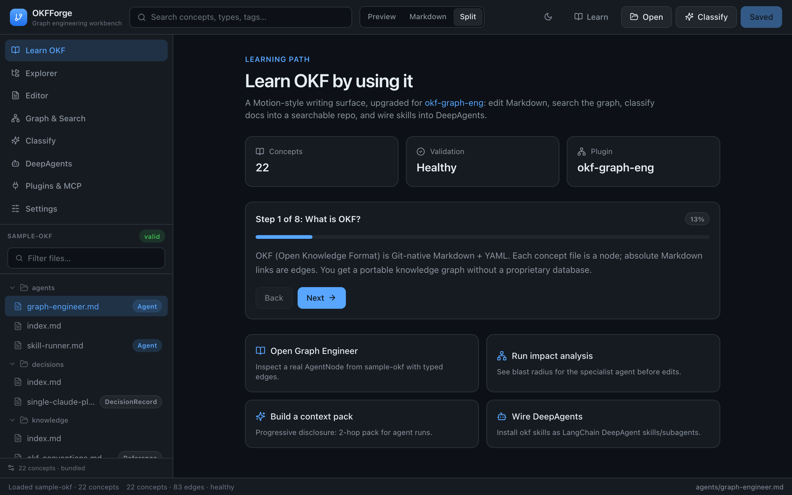
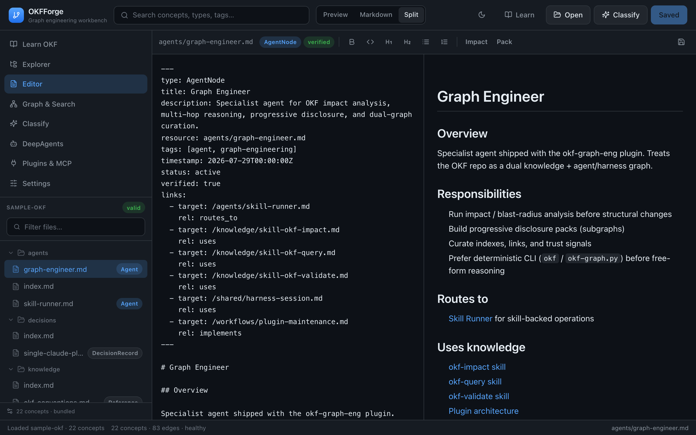
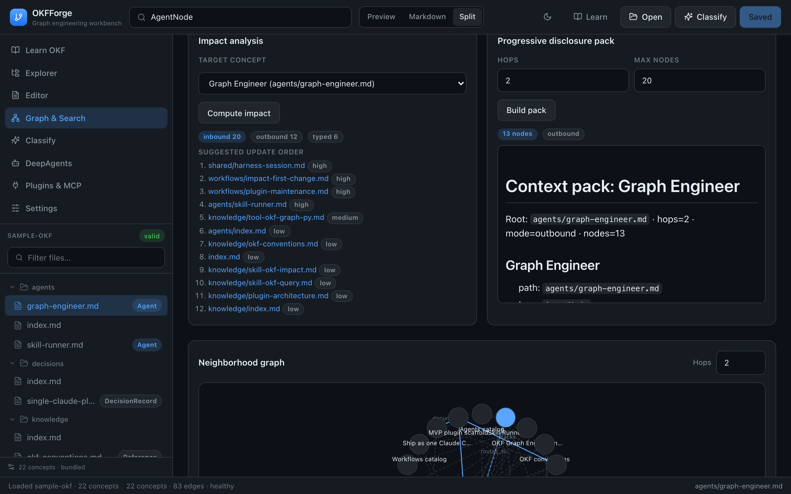
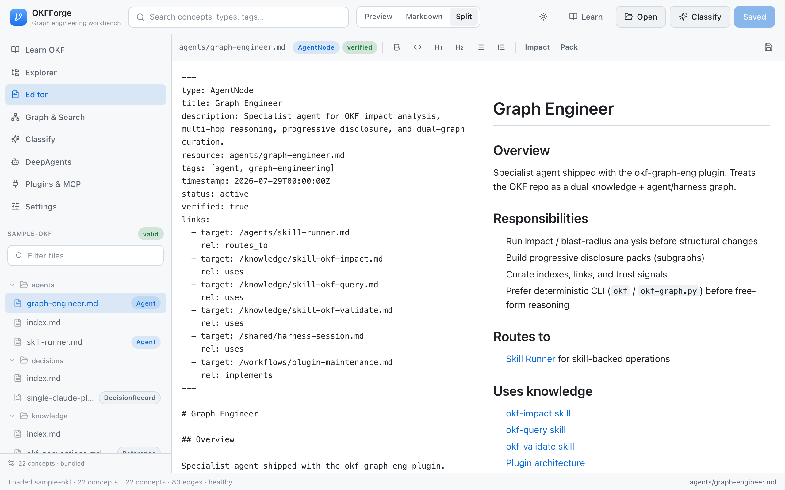
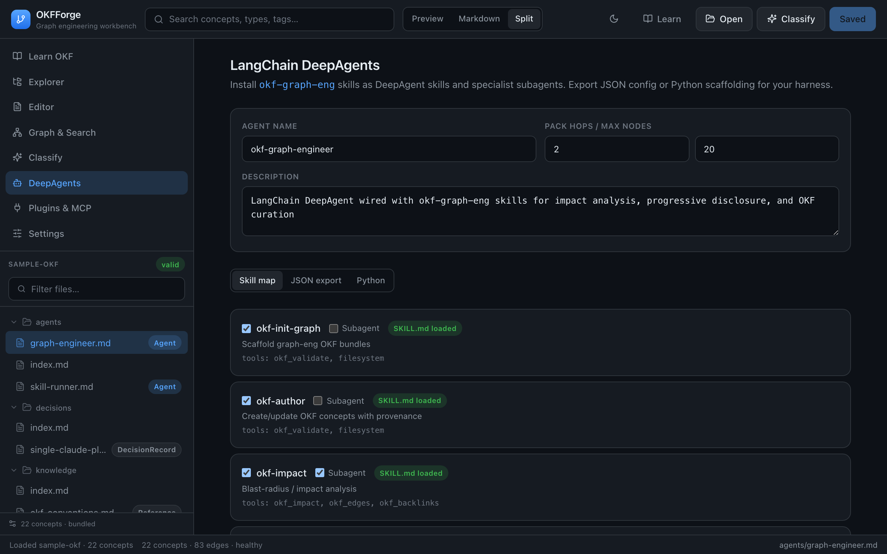
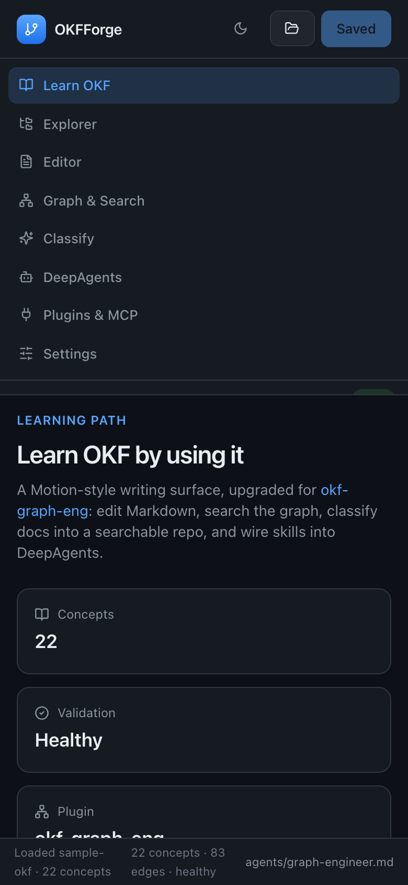

# OKFForge

**Local-first graph engineering workbench for [Open Knowledge Format (OKF)](https://github.com/SpillwaveSolutions/okf-plugin).**

OKFForge is a Motion-inspired Markdown IDE upgraded for dual knowledge + agent graphs: edit concepts, search the graph, run impact analysis, classify documents into searchable OKF repos, and wire skills into LangChain DeepAgents and Claude plugins / MCP.

<p align="center">
  
</p>

| Mode | Best for |
|------|----------|
| **Web** | Live preview, Playwright, Vercel deploy, browser-agent testing |
| **Desktop (Tauri)** | Native folder picker, jailed filesystem, standalone installers |

---

## Screenshots

### Markdown editor (split source + preview)

Edit OKF concepts with YAML frontmatter, typed links, and live preview — Impact and Pack shortcuts on the toolbar.

<p align="center">
  
</p>

### Impact analysis & progressive disclosure

Search the graph, compute blast radius for a concept, and build N-hop context packs for agent runs.

<p align="center">
  
</p>

### Light and dark themes

Cycle light / dark / system from the header. The palette is two layers of CSS
variables behind `@theme inline`, so flipping the theme repaints every existing
utility class without touching a component.

<p align="center">
  
</p>

### LangChain DeepAgents export

Map okf-graph-eng skills to DeepAgent skills / subagents and export JSON or Python scaffolding.

<p align="center">
  
</p>

### Mobile-friendly shell

Same workbench scales to a narrow viewport for on-the-go browsing of catalogs and the learning path.

<p align="center">
  
</p>

---

## Documentation

| Doc | Description |
|-----|-------------|
| **[FEATURES.md](./FEATURES.md)** | Complete feature list — editor, graph ops, classify, DeepAgents, plugins, desktop |
| **[USER_GUIDE.md](./USER_GUIDE.md)** | How to use and configure (includes running as a Tauri app) |
| **[DEVELOPERS.md](./DEVELOPERS.md)** | Setup, test, architecture — **[build & deploy Tauri locally](./DEVELOPERS.md#7-build--deploy-the-tauri-app-locally)** |
| [DESKTOP.md](./DESKTOP.md) | Short Tauri dual-mode reference (web FS API + standalone binaries) |

---

## Quick start (web)

```bash
npm install
npm run dev          # http://0.0.0.0:8080
```

Open the app, walk **Learn OKF**, or **Open** → sample / GitHub / folder / scaffold.

```bash
npm run verify       # typecheck + unit + Playwright e2e
npm run build        # production (Vercel / Nitro)
```

## Quick start (desktop / Tauri)

```bash
# Requires Rust + Tauri OS deps — see DEVELOPERS.md §2 and §7
npm install
npm run tauri:dev      # native window + Vite HMR on :8080

# Release binary + installers on this machine
npm run tauri:build
# → src-tauri/target/release/okfforge[.exe]
# → src-tauri/target/release/bundle/  (dmg, msi, AppImage, deb, …)
```

Once the desktop app is installed, open **Settings** and click **Install okff** to
put a launcher on your `PATH`:

```bash
okff .            # open the current directory in OKF Forge
okff ~/my-okf     # open a specific one
```

Local install and verification steps: **[DEVELOPERS.md §7](./DEVELOPERS.md#7-build--deploy-the-tauri-app-locally)**.  
End-user desktop walkthrough: **[USER_GUIDE.md §2](./USER_GUIDE.md#2-running-as-a-tauri-app)**.

## What you can do

- **Edit** OKF Markdown with Preview / Markdown / Split modes and ⌘S save  
- **Explore** catalogs with type badges and validation status  
- **Search** concepts; run **impact**, **context packs**, and neighborhood graphs  
- **Classify** raw docs into typed OKF paths and build a new repo  
- **DeepAgents** — map okf-graph-eng skills → JSON / Python export  
- **Plugins & MCP** — configure Claude plugins and MCP servers (browser-persisted)  
- **Desktop or web** — same UI; native FS jail on Tauri, `/api/fs` for Playwright  
- **Light, dark, or system** theme — follows your OS by default, remembered after that  
- **Zoom the type** on desktop with ⌘+ / ⌘− / ⌘0, also remembered  
- **Open from the shell** with `okff <dir>` — installed from Settings, macOS for now  
- **Navigate the file tree by keyboard** — arrows, Home/End, and type-to-find  

Details: **[FEATURES.md](./FEATURES.md)** · Walkthrough: **[USER_GUIDE.md](./USER_GUIDE.md)**

## Related projects

- [SpillwaveSolutions/okf-plugin](https://github.com/SpillwaveSolutions/okf-plugin) — `okf-graph-eng` skills & sample-okf  
- [SpillwaveSolutions/motion](https://github.com/SpillwaveSolutions/motion) — UI inspiration (local-first technical writing IDE)

## License

Private / project workspace unless otherwise stated by the publisher.
