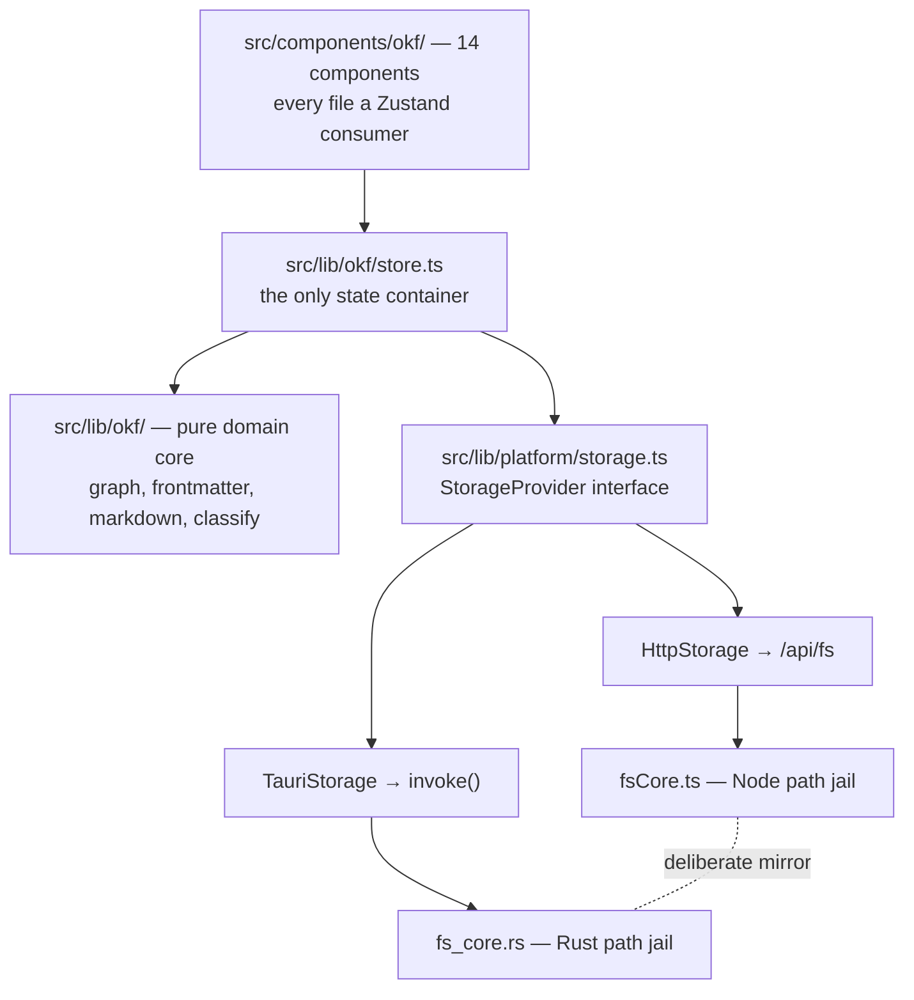

# OKF Forge — Design Document

## 1. Document Overview

Generated against `PLACEHOLDER_SHORT` on `main`, tag `v0.1.1`. Every code claim below
cites a repository-relative path and, where useful, a function and line range.

**Sections omitted, with reasons.** Database design — the only SQL in the repo
(`migrations/0001_auth.sql`) is dead template code, and the graph is held in
memory. Cache design — none exists; the bundle is reparsed wholesale on every
save. AI endpoint / managed AI platform design — the app *exports*
configuration for external agent runtimes but never calls a model itself.
Event-driven processing — no queues, no workers. Observability — no telemetry
is collected, deliberately, in a local-first tool.

## 2. Executive Summary

OKF Forge treats a folder of Markdown files with YAML frontmatter as a **dual
graph**: a knowledge graph of concepts and an agent/harness graph of the
workflows that operate on them. It provides a split source/preview editor plus
graph operations over that structure — search, impact analysis, N-hop context
packs for progressive disclosure, neighborhood subgraphs, and structural
validation.

It ships as one user interface on two runtimes: a web build served through
TanStack Start and Nitro, and a desktop build in Tauri 2 with a native folder
picker and a Rust filesystem jail.

Roughly 7,100 lines of first-party code, excluding tests: 3,294 in the domain
core (`src/lib/okf/`, 10 files), 2,660 in the UI (`src/components/okf/`, 14
files), 445 in the platform layer (`src/lib/platform/`, 4 files), and 724 in
Rust (`src-tauri/src/`, 4 files).

## 3. Requirements Summary

Drawn from `FEATURES.md` and `README.md`:

- Open an OKF bundle from a sample, a GitHub repository, an upload, or a local
  folder, and edit it in place.
- Answer graph questions over it: what does this concept reach, what breaks if
  I change it, what is the smallest context pack that explains it.
- Validate structure — broken links, missing required frontmatter, orphans.
- Run identically on web and desktop, with real disk access only on desktop.
- Stay local-first. Multiplayer is an explicit non-goal.

## 4. System Context

The application has no backend of its own. Its external touchpoints are the
GitHub raw-content API (bundle loading), the local filesystem (desktop, and
the dev server in web mode), and `localStorage`. It *emits* configuration for
three external consumers — DeepAgents, the Claude Code plugin format, and MCP
servers — via `src/lib/okf/integrations.ts`, but never invokes them.

## 5. High-Level Architecture

The critical property is that the React tree, the store, and the graph engine
are entirely runtime-agnostic. Only `getStorage()`
(`src/lib/platform/storage.ts:133-137`) knows which runtime it is in, selecting
on `isTauriRuntime()` (`:124-131`), which sniffs `window.__TAURI_INTERNALS__`.
Tauri API imports are dynamic (`await import(...)`) so the browser bundle never
pulls them in.

## 6. Architectural Decisions

**The bundle is a flat map, not a filesystem handle.** An `OkfBundle` carries
`Record<path, content>`. This is what lets the same code path serve a GitHub
tarball, an upload, a scaffold, and a real directory. The cost is that disk
writes need a prefix re-added — `workspacePrefix` in `store.ts` — because the
logical OKF root may sit below the folder the user opened.

**Two parsers, hand-rolled, deliberately partial.** `frontmatter.ts` understands
flat scalars, inline `[a, b]` arrays, and one nested `links:` shape;
`markdown.ts` renders a subset of Markdown. Neither has a library dependency.
The tradeoff is explicit: an OKF file that uses richer YAML will not parse.

**Edges merge from two sources, typed wins.** Markdown `[text](path)` links
produce untyped `rel: "links_to"` edges; frontmatter `links:` entries produce
typed ones. `mergeEdges` dedupes *by target*, so a typed edge always beats an
untyped one to the same file. `loadConcepts` (`graph.ts:22`) then filters
`outbound` to targets that actually exist, keeping the runtime graph closed —
broken links survive only in `edges`, which is exactly how `validateBundle`
(`graph.ts:349`) finds them.

**Two Vite configs, on purpose.** `vite.config.ts` is web/SSR with Nitro gated
to `command === "build"`; leaving Nitro on in dev opens a second port and
breaks the port contract. `vite.tauri.config.ts` is the desktop SPA with
`base: "./"` for relative asset paths inside the webview.

**A cargo feature, not `debug_assertions`, for automation.** The MCP bridge and
embedded WebDriver server are optional dependencies behind
`--features automation` (`src-tauri/Cargo.toml`), so a release build does not
contain them at all. Their capability is added at *runtime* from
`src-tauri/automation-capability.json`, deliberately outside `capabilities/`
which `tauri-build` scans unconditionally.

## 7. Component Inventory

| Module | Responsibility |
|---|---|
| `src/lib/okf/types.ts` | `Concept`, `OkfBundle`, `TypedEdge`, and the type/rel vocabularies |
| `src/lib/okf/graph.ts` | the entire graph engine — 14 exported pure functions over `Record<path, Concept>` |
| `src/lib/okf/store.ts` | Zustand store; the app's only state container |
| `src/lib/okf/loaders.ts` | bundle acquisition: sample, GitHub, upload, scaffold |
| `src/lib/okf/frontmatter.ts` | hand-rolled YAML-ish parser |
| `src/lib/okf/markdown.ts` | hand-rolled Markdown renderer |
| `src/lib/okf/classify.ts` | heuristic raw-docs → typed OKF paths |
| `src/lib/okf/integrations.ts` | DeepAgents / Claude plugin / MCP exporters; also owns `localStorage` persistence |
| `src/lib/okf/prefs.ts` | theme and zoom preferences; pure except one DOM writer |
| `src/lib/okf/tree.ts` | the sidebar tree's keyboard and ARIA model — flatten, key resolution, typeahead |
| `src/lib/platform/storage.ts` | `StorageProvider` interface, `HttpStorage`, `TauriStorage` |
| `src/lib/platform/fsCore.ts` | Node-only path jail and walker; never in the browser bundle |
| `src/lib/platform/fsApiPlugin.ts` | Vite dev middleware for `/api/fs/*` |
| `src/lib/platform/cli.ts` | the `okff` launcher's IPC surface; deliberately outside `StorageProvider` |
| `src-tauri/src/lib.rs` | eight `#[tauri::command]` entry points, plus argv handling |
| `src-tauri/src/fs_core.rs` | the Rust path jail |
| `src-tauri/src/cli.rs` | shim rendering, `--workspace` parsing, and the `okff` installer |

## 8. End-to-End Workflows

**Opening a folder on desktop.** The user picks a directory through the native
dialog. `set_workspace` (`lib.rs:25`) realpaths it and stores it in a
`Mutex<WorkspaceState>`. `list_markdown_files` (`lib.rs:63`) walks it via
`collect_files` (`fs_core.rs:108`). The store's `resolveWorkspaceSelection`
then decides whether the logical OKF root is the folder itself or a nested
`sample-okf/` or `.okf/` subtree, computes `workspacePrefix`, and builds the
bundle. `buildFromBundle` (`graph.ts:606`) parses and validates.

**Saving an edit.** `saveEditor` writes through the active `StorageProvider`,
then calls `recompute`, which reruns `buildFromBundle` over the *entire*
bundle. This is correct and simple; it is also a performance cliff past the
400-file cap in `MAX_WORKSPACE_MD_FILES` (`store.ts:174`).

**Opening a folder from the shell.** `okff <dir>` is a script on `PATH` that
runs `open -n -b com.okf.forge --args --workspace "$dir"`, resolving the app by
bundle identifier so relocating `OKFForge.app` does not break the command. On
the Rust side, `run()` (`lib.rs:106`) scans argv through
`workspace_from_args` (`cli.rs:36`) *before* building the app and seeds the
same `Mutex<WorkspaceState>` the picker would have set. Nothing new crosses the
IPC boundary for this: `TauriStorage.getWorkspaceRoot()` already calls
`get_workspace` and returns `null` when unset, so `init` (`store.ts:335`)
simply asks, and loads that folder instead of the bundled sample when the
answer is non-null. An unparseable or missing path is ignored rather than
fatal — a GUI launch has no terminal, so exiting on a stale argument would read
to the user as a crash.

**Installing that shim.** The Settings view calls `install_cli`, which renders
the script with `current_exe()`'s `.app` ancestor baked in as a fallback
launcher, then writes `/usr/local/bin/okff`. It escalates through
`osascript … with administrator privileges` **only when that directory is not
already writable**, so a machine where the user owns `/usr/local/bin` sees no
prompt at all. `cli_status` reports whether the installed file carries our
marker comment, which is what stops a hand-written `okff` from being
overwritten silently.

**Switching theme.** A pre-paint inline script in `src/routes/__root.tsx` and
`tauri.html` reads `localStorage` and stamps `data-theme` on `<html>` before
first paint. `initPrefs` then adopts it into the store, and a `matchMedia`
listener re-resolves while the preference is `system`.

## 9. Complex Business Logic

**`pack` (`graph.ts:195`)** implements progressive disclosure: a breadth-first
expansion from a root concept, bounded by both hop count and node budget, that
returns the smallest useful context set rather than the full transitive
closure. This is the function the whole "context pack" feature exists for.

**`criticalityOf` (`graph.ts:100`)** derives a criticality signal from
frontmatter and graph position, which `impact` (`graph.ts:155`) then uses to
rank blast radius rather than reporting a flat list.

**`resolveConcept` (`graph.ts:66`)** accepts a path, a title, or a partial and
resolves it to a canonical path. Every user-facing graph action routes through
it, so a user can type what they remember rather than an exact path.

## 10. Security Design

The only meaningful attack surface is the filesystem jail, and it exists twice.

`fsCore.ts` and `fs_core.rs` are **deliberate mirrors**, matching name for name
— `isInsideWorkspace`/`is_inside_workspace`, `resolveInWorkspace`/
`resolve_in_workspace`, `collectFiles`/`collect_files`,
`readWorkspaceFile`/`read_workspace_file`, `writeWorkspaceFile`/
`write_workspace_file`. They share one rule: realpath both sides, then check
containment **by path component**, so `/ws-evil/x.md` cannot escape `/ws` via a
string prefix match. `fs_core.rs:63` and `fsCore.ts:31` are the two halves of
that check, and both are covered by tests.

Any change to filesystem behavior must update both files and both suites. This
is the repository's single most important invariant.

`/api/fs` is dev-only (`apply: "serve"`) and 404s in a production web build.
Production disk access is desktop-only.

## 11. Configuration

`OKF_WORKSPACE` points `/api/fs` at a real directory in web dev mode.
`OKF_DEV_PORT` overrides the resolved dev port for one run. There are no
secrets: the app has no accounts, no API keys, and no outbound authenticated
calls.

The dev port itself is resolved, never hardcoded. `scripts/dev-port.mjs` probes
for a free port at or above 8080, remembers it in `.dev-port`, and — critically
— verifies that a *reused* port is serving this application rather than a
sibling project's. Several Tauri projects share the development machine and all
ship the same default port; without the identity check, Playwright's
`reuseExistingServer` silently ran the entire suite against another project's
app.

## 12. Testing Strategy

Four tiers with disjoint file globs, so no test is ever collected twice:

| Tier | Glob | Runner |
|---|---|---|
| pure functions | `tests/*.test.ts` | `node:test` with `--experimental-strip-types` |
| component / integration | `src/**/*.test.ts(x)` | vitest + jsdom |
| web end-to-end | `e2e/*.spec.ts` | Playwright, chromium |
| desktop end-to-end | `e2e-desktop/specs/*.e2e.ts` | WebdriverIO against the real Tauri window |

A `globalSetup` guards the Playwright tier: it fetches `/api/fs/workspace`
before any spec runs and refuses the run when the root is inside the
repository. `webServer.env` reaches only a server Playwright spawns itself, and
`reuseExistingServer` is on outside CI, so a dev server started by hand — which
falls back to the tracked `public/sample-okf` — used to be reused silently
while the writing specs mutated tracked files.

The first three plus `cargo test` are required checks on `main`. The desktop
tier is deliberately **not** required: it needs a full cargo build and a real
window, making it the slowest and flakiest tier, and blocking a documentation
change on it would be a bad trade. It runs weekly and on demand.

Visual criteria live in `docs/designs/ui-*.md` as rubrics split into gate rows,
each naming a real test, and `agent` rows that are advisory and never block. A
gate whose failure mode is "the model was in a mood" is worse than no gate.

## 13. Deployment Architecture

Web builds through Nitro's Vercel preset into `.vercel/output/`. Desktop builds
through `tauri build` into `src-tauri/target/release/bundle/`. Note that
`.vercel/output/`, `dist/`, and `src-tauri/target/` are **committed** — the
`.gitignore` is minimal, so build artifacts appear in diffs.

`npm run tauri:build` produces both artifacts on macOS: `OKFForge.app` and a
checksum-valid `.dmg` carrying the app plus the conventional `/Applications`
symlink. The `--no-bundle` flag used by the automation build is a speed
choice for the WebdriverIO binary, which is launched directly.

## 14. Known Weaknesses

Stated plainly, because a design document that only lists strengths is
marketing:

- **Dead code from the template.** `src/lib/auth/`, `src/lib/db.ts`,
  `src/lib/multiplayer/`, and `migrations/0001_auth.sql` are leftovers from a
  TanStack Start + better-auth + PGlite + WebRTC starter. Nothing imports them.
  Authentication does not work and is not meant to.
- **Effectively one route.** All eight views are conditional renders driven by
  `store.view`, not URLs. Deep-linking to a concept is impossible.
- **Full reparse on every save.** Fine at 400 files, a cliff beyond it.
- **`tsconfig` `include` is `["src"]`**, so `tests/`, `e2e/`, `scripts/`, and
  the Vite configs are not covered by `npm run typecheck`.
- **21 `@radix-ui` packages are installed and entirely unimported**, while
  `OpenBundleDialog.tsx` hand-rolls a dialog with no focus trap.
- **The `okff` installer is macOS-only.** The shim calls `open(1)` and
  escalation goes through `osascript`; Windows and Linux return an explicit
  error. No packaged build exists for either platform, so there is nothing to
  install to yet.
- **Two desktop windows share one preference store.** `okff` opens an
  independent instance per invocation, but both processes load the same
  `localStorage` origin, so a theme or zoom change in one reaches the other
  only after that window reloads, and the last write wins.
