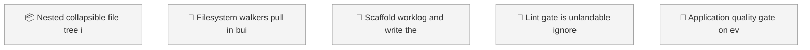

<!-- GENERATED by worklog roadmap-render. DO NOT EDIT. -->

> This file is generated from `.work/todo.jsonl`. Edits will be overwritten.
> To change the roadmap, change the work items: `worklog add|update|close`.

# Roadmap

_0 epic(s) in flight, 5 open item(s), 0 blocked, 0 unclassified._

## Now

_Nothing here._

## Next

### (no epic)

| # | Item | Type | Priority | Status | Blocked by |
|---|---|---|---|---|---|
| 01KYZ24K | Nested collapsible file tree in the sidebar | story | P2 | todo | — |
| 01KYZ24K | Filesystem walkers pull in build output and flatten upload paths | task | P2 | todo | — |
| 01KYZ27E | Scaffold worklog and write the project agent guide | task | P2 | todo | — |
| 01KYZ8TZ | Lint gate is unlandable: ignore holes plus prefer-const errors | task | P2 | todo | — |
| 01KYZ8V0 | Application quality gate on every pull request | story | P2 | todo | — |

## Later

_Nothing here._

## Milestones

### v0.1.0

| # | Item | Type | Priority | Status | Blocked by |
|---|---|---|---|---|---|
| 01KYZ24K | Nested collapsible file tree in the sidebar | story | P2 | todo | — |
| 01KYZ24K | Filesystem walkers pull in build output and flatten upload paths | task | P2 | todo | — |
| 01KYZ27E | Scaffold worklog and write the project agent guide | task | P2 | todo | — |
| 01KYZ8TZ | Lint gate is unlandable: ignore holes plus prefer-const errors | task | P2 | todo | — |
| 01KYZ8V0 | Application quality gate on every pull request | story | P2 | todo | — |

## Visual roadmap

### Dependency graph

### Hierarchy

