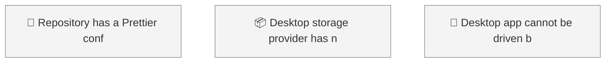
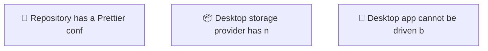

<!-- GENERATED by worklog roadmap-render. DO NOT EDIT. -->

> This file is generated from `.work/todo.jsonl`. Edits will be overwritten.
> To change the roadmap, change the work items: `worklog add|update|close`.

# Roadmap

_0 epic(s) in flight, 3 open item(s), 0 blocked, 0 unclassified._

## Now

_Nothing here._

## Next

### (no epic)

| # | Item | Type | Priority | Status | Blocked by |
|---|---|---|---|---|---|
| 01KYZN9K | Repository has a Prettier config but was never formatted | task | P2 | todo | — |
| 01KYZN9K | Desktop storage provider has no JavaScript test coverage | story | P2 | todo | — |
| 01KYZN9M | Desktop app cannot be driven by automation | story | P2 | todo | — |

## Later

_Nothing here._

## Milestones

### v0.1.0

| # | Item | Type | Priority | Status | Blocked by |
|---|---|---|---|---|---|
| 01KYZN9K | Repository has a Prettier config but was never formatted | task | P2 | todo | — |
| 01KYZN9K | Desktop storage provider has no JavaScript test coverage | story | P2 | todo | — |
| 01KYZN9M | Desktop app cannot be driven by automation | story | P2 | todo | — |

## Visual roadmap

### Dependency graph

### Hierarchy

