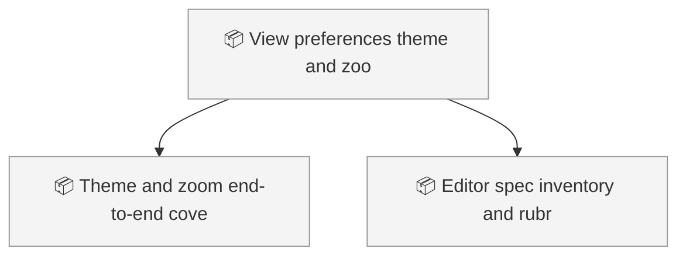
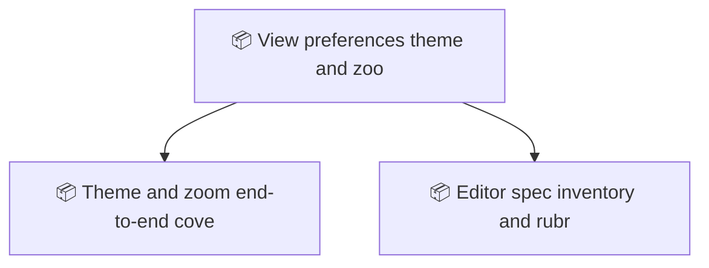

<!-- GENERATED by worklog roadmap-render. DO NOT EDIT. -->

> This file is generated from `.work/todo.jsonl`. Edits will be overwritten.
> To change the roadmap, change the work items: `worklog add|update|close`.

# Roadmap

_1 epic(s) in flight, 2 open item(s), 0 blocked, 0 unclassified._

## Now

_Nothing here._

## Next

### View preferences: theme and zoom  ·  P1  ·  7 of 9 done  ·  feature 8 / bug 1
Give the workbench a light/dark/system theme toggle and a desktop font-zoom that survives restarts, then backfill UI specs and wireframes for every view so screens can be judged against a contract instead of by eye.

| # | Item | Type | Priority | Status | Blocked by |
|---|---|---|---|---|---|
| 01KZ2M33 | Theme and zoom end-to-end coverage | task | P1 | todo | — |
| 01KZ2M33 | Editor spec inventory and rubric rows | task | P1 | todo | — |

## Later

_Nothing here._

## Visual roadmap

### Dependency graph

### Hierarchy

