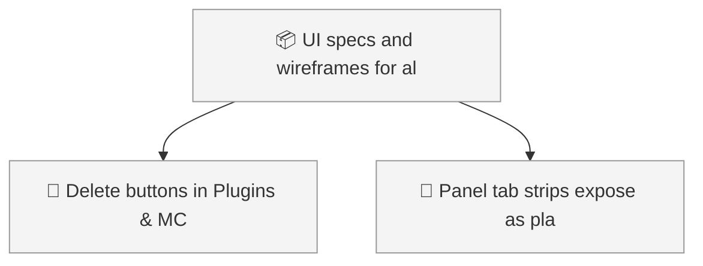
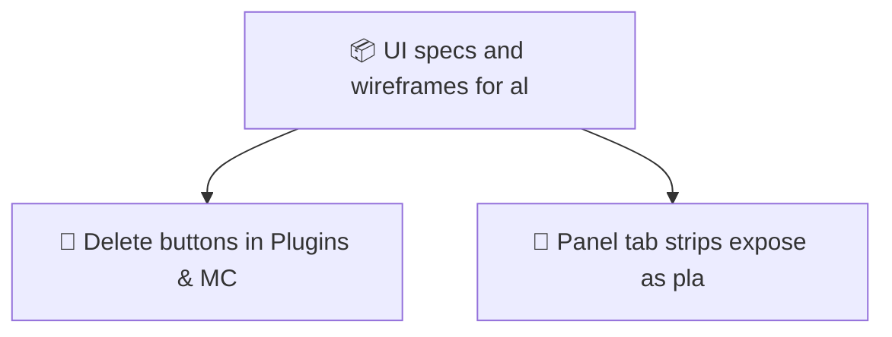

<!-- GENERATED by worklog roadmap-render. DO NOT EDIT. -->

> This file is generated from `.work/todo.jsonl`. Edits will be overwritten.
> To change the roadmap, change the work items: `worklog add|update|close`.

# Roadmap

_1 epic(s) in flight, 2 open item(s), 0 blocked, 0 unclassified._

## Now

_Nothing here._

## Next

### UI specs and wireframes for all views  ·  P1  ·  6 of 8 done  ·  feature 6 / bug 2
Every view gets a spec with an element inventory that gates merges, a Salt wireframe, and a rubric with the gate/advice split and an Acceptable-differences section.

| # | Item | Type | Priority | Status | Blocked by |
|---|---|---|---|---|---|
| 01KZ310M | Delete buttons in Plugins & MCP have no accessible name | task | P2 | todo | — |

## Later

### UI specs and wireframes for all views  ·  P1  ·  6 of 8 done  ·  feature 6 / bug 2
Every view gets a spec with an element inventory that gates merges, a Salt wireframe, and a rubric with the gate/advice split and an Acceptable-differences section.

| # | Item | Type | Priority | Status | Blocked by |
|---|---|---|---|---|---|
| 01KZ310M | Panel tab strips expose as plain buttons | task | P3 | todo | — |

## Visual roadmap

### Dependency graph

### Hierarchy

