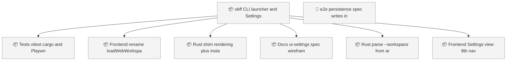
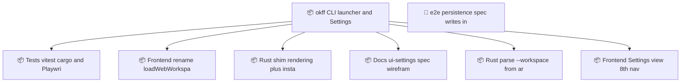

<!-- GENERATED by worklog roadmap-render. DO NOT EDIT. -->

> This file is generated from `.work/todo.jsonl`. Edits will be overwritten.
> To change the roadmap, change the work items: `worklog add|update|close`.

# Roadmap

_1 epic(s) in flight, 7 open item(s), 0 blocked, 0 unclassified._

## Now

_Nothing here._

## Next

### okff CLI launcher and Settings view  ·  P1  ·  0 of 6 done
Ship a shell command that opens OKF Forge on a directory. A shim at /usr/local/bin/okff calls open(1) with a --workspace argument; the Rust side reads that argument at startup and seeds the workspace mutex so the app opens on that folder. A new Settings view installs and removes the shim, escalating once via osascript only when /usr/local/bin is not writable.

| # | Item | Type | Priority | Status | Blocked by |
|---|---|---|---|---|---|
| 01KZ4EZ2 | Tests: vitest, cargo, and Playwright coverage for the new surfaces | task | P2 | todo | — |
| 01KZ4EZ2 | Frontend: rename loadWebWorkspace and seed the desktop workspace on init | task | P2 | todo | — |
| 01KZ4EZ2 | Rust: shim rendering plus install_cli / uninstall_cli / cli_status commands | task | P2 | todo | — |
| 01KZ4EZ2 | Docs: ui-settings spec, wireframe, and the nav line in seven existing specs | task | P2 | todo | — |
| 01KZ4EZ2 | Rust: parse `--workspace` from argv and seed WorkspaceState | task | P2 | todo | — |
| 01KZ4EZ2 | Frontend: Settings view, 8th nav item, CLI install card | task | P2 | todo | — |

### (no epic)

| # | Item | Type | Priority | Status | Blocked by |
|---|---|---|---|---|---|
| 01KZ4FN7 | e2e persistence spec writes into the tracked public/sample-okf fixture | task | P2 | todo | — |

## Later

_Nothing here._

## Visual roadmap

### Dependency graph

### Hierarchy

